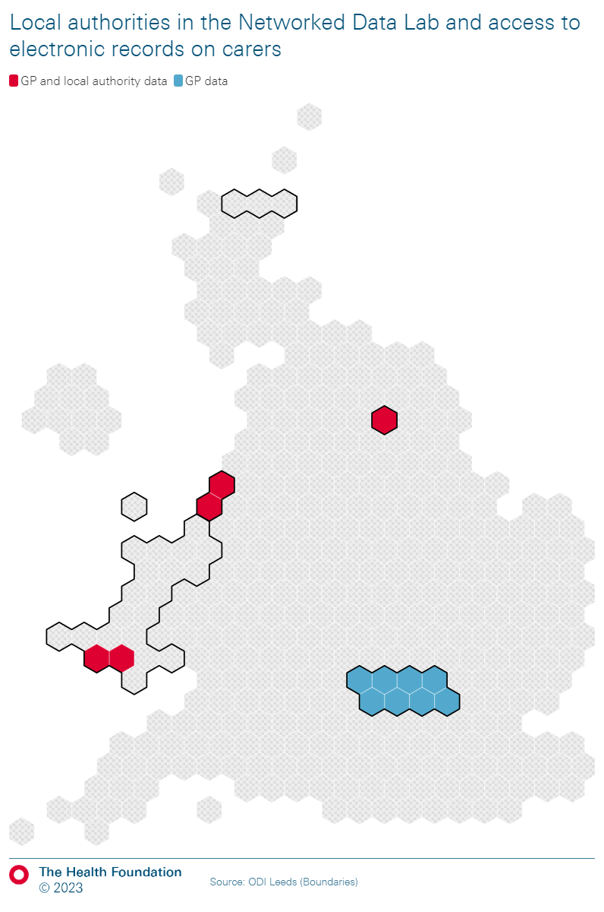

```{r, echo=FALSE, message=FALSE, warning=FALSE}
#Load packages

library(aws.s3)
library(readxl)
library(writexl)
library(readODS)
library(tidyverse)
library(janitor)
library(data.table)
library(splitstackshape)
library(ggpubr)
library(viridis)
library(eulerr)
library(kableExtra)
library(knitr)

#Clean up the global environment

rm(list = ls())

#Directories in S3

IHT_bucket <- "s3://thf-dap-tier0-projects-iht-067208b7-projectbucket-1mrmynh0q7ljp"
ASC_subfolder <- "ASC and Finance Report"
R_workbench <- path.expand("~")
localgit <- dirname(rstudioapi::getSourceEditorContext()$path)

#Themes

theme_vert <- theme(strip.text = element_text(size=10),
                    text = element_text(size = 10),
                    legend.title=element_text(size=10),
                    legend.text=element_text(size=10),
                    axis.text = element_text(size = 10),
                    axis.text.y = element_text(size = 10),
                    axis.text.x = element_text(angle = 90, hjust = 1,size = 5),
                    axis.title.x = element_text(margin = unit(c(3, 0, 0, 0), "mm"),size = 10),
                    axis.title.y = element_text(size = 10))
```

```{r, echo=FALSE, message=FALSE, warning=FALSE}
#Ingest data
ndl_carers_central <- s3read_using(fread,
                                          object = "NDL-carers-partner-data/ndl_carers_central.csv",
                                          bucket = IHT_bucket)

#Dataset per area
npt <- ndl_carers_central %>% filter(local_authority=="Neath Port Talbot")
swansea <- ndl_carers_central %>%  filter(local_authority=="Swansea")
nwl <- ndl_carers_central %>%  filter(local_authority=="North West London")
law <- ndl_carers_central %>%  filter(local_authority=="Liverpool and Wirral")
leeds <- ndl_carers_central %>%  filter(local_authority=="Leeds")
```

## NDL areas and data availability

```{r, eval=TRUE, echo=FALSE, message=FALSE, warning=FALSE}

```

## Table 1: Lookback period {.tabset}

### Neath Port Talbot (Wales)

```{r, eval=TRUE, echo=FALSE, message=FALSE, warning=FALSE}
npt %>%
  filter(source %in% c("LA","GP")) %>% 
  group_by(local_authority,source) %>%
  summarise(period_start=first(period_start),
            period_end=first(period_end)) %>% 
  ungroup() %>%
  kbl() %>%
  kable_styling(bootstrap_options = "striped", full_width = F, position = "left")
```

### Swansea (Wales)

```{r, eval=TRUE, echo=FALSE, message=FALSE, warning=FALSE}
swansea %>%
  filter(source %in% c("LA","GP")) %>% 
  group_by(local_authority,source) %>%
  summarise(period_start=first(period_start),
            period_end=first(period_end)) %>% 
  ungroup() %>%
  kbl() %>%
  kable_styling(bootstrap_options = "striped", full_width = F, position = "left")
```

### North West London

```{r, eval=TRUE, echo=FALSE, message=FALSE, warning=FALSE}
nwl %>%
  filter(source %in% c("LA","GP")) %>% 
  group_by(local_authority,source) %>%
  summarise(period_start=first(period_start),
            period_end=first(period_end)) %>% 
  ungroup() %>%
  kbl() %>%
  kable_styling(bootstrap_options = "striped", full_width = F, position = "left")
```

### Liverpool and Wirral

```{r, eval=TRUE, echo=FALSE, message=FALSE, warning=FALSE}
law %>%
  filter(source %in% c("LA","GP")) %>% 
  group_by(local_authority,source) %>%
  summarise(period_start=first(period_start),
            period_end=first(period_end)) %>% 
  ungroup() %>%
  kbl() %>%
  kable_styling(bootstrap_options = "striped", full_width = F, position = "left")
```

### Leeds

```{r, eval=TRUE, echo=FALSE, message=FALSE, warning=FALSE}
leeds %>%
  filter(source %in% c("LA","GP")) %>% 
  group_by(local_authority,source) %>%
  summarise(period_start=first(period_start),
            period_end=first(period_end)) %>% 
  ungroup() %>%
  kbl() %>%
  kable_styling(bootstrap_options = "striped", full_width = F, position = "left")
```

## Chart 1: Overlap between GP and ASC data {.tabset}

### Neath Port Talbot (Wales)

```{r, eval=TRUE, echo=FALSE, message=FALSE, warning=FALSE}
euler_chart_data <- npt %>%
  filter(type=="all carers") %>%
  filter(source %in% c("GP only","LA only","GP and LA"))

euler_object <- euler(c("GP" = euler_chart_data %>% filter(source=="GP only") %>% pull(count) %>% as.numeric(),
                        "LA" = euler_chart_data %>% filter(source=="LA only") %>% pull(count) %>% as.numeric(),
                        "GP&LA" = euler_chart_data %>% filter(source=="GP and LA") %>% pull(count) %>% as.numeric()))
plot(euler_object,quantities = list(type = c("percent", "counts")))
```

### Swansea (Wales)

```{r, eval=TRUE, echo=FALSE, message=FALSE, warning=FALSE}
euler_chart_data <- swansea %>%
  filter(type=="all carers") %>%
  filter(source %in% c("GP only","LA only","GP and LA"))

euler_object <- euler(c("GP" = euler_chart_data %>% filter(source=="GP only") %>% pull(count) %>% as.numeric(),
                        "LA" = euler_chart_data %>% filter(source=="LA only") %>% pull(count) %>% as.numeric(),
                        "GP&LA" = euler_chart_data %>% filter(source=="GP and LA") %>% pull(count) %>% as.numeric()))
plot(euler_object,quantities = list(type = c("percent", "counts")))
```

### North West London

```{r, eval=TRUE, echo=FALSE, message=FALSE, warning=FALSE}
euler_chart_data <- nwl %>%
  filter(type=="all carers") %>%
  filter(source %in% c("GP"))

euler_object <- euler(c("GP" = euler_chart_data %>% filter(source=="GP") %>% pull(count) %>% as.numeric(),
                        "LA" = 0,
                        "GP&LA" = 0))
plot(euler_object,quantities = list(type = c("percent", "counts")))
```

### Liverpool and Wirral

```{r, eval=TRUE, echo=FALSE, message=FALSE, warning=FALSE}
euler_chart_data <- law %>%
  filter(type=="all carers") %>%
  filter(source %in% c("GP only","LA only","GP and LA"))

euler_object <- euler(c("GP" = euler_chart_data %>% filter(source=="GP only") %>% pull(count) %>% as.numeric(),
                        "LA" = euler_chart_data %>% filter(source=="LA only") %>% pull(count) %>% as.numeric(),
                        "GP&LA" = euler_chart_data %>% filter(source=="GP and LA") %>% pull(count) %>% as.numeric()))
plot(euler_object,quantities = list(type = c("percent", "counts")))
```

### Leeds

```{r, eval=TRUE, echo=FALSE, message=FALSE, warning=FALSE}
euler_chart_data <- leeds %>%
  filter(type=="all carers") %>%
  filter(source %in% c("GP only","LA only","GP and LA"))

euler_object <- euler(c("GP" = euler_chart_data %>% filter(source=="GP only") %>% pull(count) %>% as.numeric(),
                        "LA" = euler_chart_data %>% filter(source=="LA only") %>% pull(count) %>% as.numeric(),
                        "GP&LA" = euler_chart_data %>% filter(source=="GP and LA") %>% pull(count) %>% as.numeric()))
plot(euler_object,quantities = list(type = c("percent", "counts")))
```

## Chart 2: Carers in administrative records compared to census [absolute] {.tabset}

### Neath Port Talbot (Wales)

```{r, eval=TRUE, echo=FALSE, message=FALSE, warning=FALSE}
chart1_data <- npt %>%
  filter(type=="all carers") %>%
  filter(source %in% c("GP or LA","2021 Census")) %>%
  mutate(count=as.numeric(count),
         percent=as.numeric(count)/sum(as.numeric(count)))

ggplot(data=chart1_data, aes(x=source,
                             y=count,
                             fill=source)) +
  geom_bar(stat="identity") +
  scale_y_continuous(labels = scales::comma, name = "Count") +
  scale_x_discrete(name = "Source") +
  theme_bw() +
  scale_fill_brewer(palette="Set2", name = "Source")
```

### Swansea (Wales)

```{r, eval=TRUE, echo=FALSE, message=FALSE, warning=FALSE}
chart1_data <- swansea %>%
  filter(type=="all carers") %>%
  filter(source %in% c("GP or LA","2021 Census")) %>%
  mutate(count=as.numeric(count),
         percent=as.numeric(count)/sum(as.numeric(count)))

ggplot(data=chart1_data, aes(x=source,
                             y=count,
                             fill=source)) +
  geom_bar(stat="identity") +
  scale_y_continuous(labels = scales::comma, name = "Count") +
  scale_x_discrete(name = "Source") +
  theme_bw() +
  scale_fill_brewer(palette="Set2", name = "Source")
```

### North West London

```{r, eval=TRUE, echo=FALSE, message=FALSE, warning=FALSE}
chart1_data <- nwl %>%
  filter(type=="all carers") %>%
  filter(source %in% c("GP","2021 Census")) %>%
  mutate(count=as.numeric(count),
         percent=as.numeric(count)/sum(as.numeric(count)))

ggplot(data=chart1_data, aes(x=source,
                             y=count,
                             fill=source)) +
  geom_bar(stat="identity") +
  scale_y_continuous(labels = scales::comma, name = "Count") +
  scale_x_discrete(name = "Source") +
  theme_bw() +
  scale_fill_brewer(palette="Set2", name = "Source")
```

### Liverpool and Wirral

```{r, eval=TRUE, echo=FALSE, message=FALSE, warning=FALSE}
chart1_data <- law %>%
  filter(type=="all carers") %>%
  filter(source %in% c("GP or LA","2021 Census")) %>%
  mutate(count=as.numeric(count),
         percent=as.numeric(count)/sum(as.numeric(count)))

ggplot(data=chart1_data, aes(x=source,
                             y=count,
                             fill=source)) +
  geom_bar(stat="identity") +
  scale_y_continuous(labels = scales::comma, name = "Count") +
  scale_x_discrete(name = "Source") +
  theme_bw() +
  scale_fill_brewer(palette="Set2", name = "Source")
```

### Leeds

```{r, eval=TRUE, echo=FALSE, message=FALSE, warning=FALSE}
chart1_data <- leeds %>%
  filter(type=="all carers") %>%
  filter(source %in% c("GP or LA","2021 Census")) %>%
  mutate(count=as.numeric(count),
         percent=as.numeric(count)/sum(as.numeric(count)))

ggplot(data=chart1_data, aes(x=source,
                             y=count,
                             fill=source)) +
  geom_bar(stat="identity") +
  scale_y_continuous(labels = scales::comma, name = "Count") +
  scale_x_discrete(name = "Source") +
  theme_bw() +
  scale_fill_brewer(palette="Set2", name = "Source")
```

## Chart 3: Carers in administrative records compared to census [relative] {.tabset}

### Neath Port Talbot (Wales)

```{r, eval=TRUE, echo=FALSE, message=FALSE, warning=FALSE}
chart1_data <- npt %>%
  filter(type=="all carers") %>%
  filter(source %in% c("GP or LA","2021 Census")) %>%
  mutate(count=as.numeric(count),
         percent=as.numeric(count)/sum(as.numeric(count)))

chart1_data %>%
  ggplot() +
  aes(x=1, percent, fill=source) +
  geom_bar(stat="identity") +
  geom_text(aes(label=paste0(sprintf("%1.1f", round(percent*100,0)),"%")),
            position=position_stack(vjust=0.5)) +
  scale_fill_brewer(palette="Set2", name = "Source") +
  scale_y_continuous(labels = scales::percent, name = "Percentage") +
  scale_x_discrete(name = "Source") +
  theme_bw()
```

### Swansea (Wales)

```{r, eval=TRUE, echo=FALSE, message=FALSE, warning=FALSE}
chart1_data <- swansea %>%
  filter(type=="all carers") %>%
  filter(source %in% c("GP or LA","2021 Census")) %>%
  mutate(count=as.numeric(count),
         percent=as.numeric(count)/sum(as.numeric(count)))

chart1_data %>%
  ggplot() +
  aes(x=1, percent, fill=source) +
  geom_bar(stat="identity") +
  geom_text(aes(label=paste0(sprintf("%1.1f", round(percent*100,0)),"%")),
            position=position_stack(vjust=0.5)) +
  scale_fill_brewer(palette="Set2", name = "Source") +
  scale_y_continuous(labels = scales::percent, name = "Percentage") +
  scale_x_discrete(name = "Source") +
  theme_bw()
```

### North West London

```{r, eval=TRUE, echo=FALSE, message=FALSE, warning=FALSE}
chart1_data <- nwl %>%
  filter(type=="all carers") %>%
  filter(source %in% c("GP","2021 Census")) %>%
  mutate(count=as.numeric(count),
         percent=as.numeric(count)/sum(as.numeric(count)))

chart1_data %>%
  ggplot() +
  aes(x=1, percent, fill=source) +
  geom_bar(stat="identity") +
  geom_text(aes(label=paste0(sprintf("%1.1f", round(percent*100,0)),"%")),
            position=position_stack(vjust=0.5)) +
  scale_fill_brewer(palette="Set2", name = "Source") +
  scale_y_continuous(labels = scales::percent, name = "Percentage") +
  scale_x_discrete(name = "Source") +
  theme_bw()
```

### Liverpool and Wirral

```{r, eval=TRUE, echo=FALSE, message=FALSE, warning=FALSE}
chart1_data <- law %>%
  filter(type=="all carers") %>%
  filter(source %in% c("GP or LA","2021 Census")) %>%
  mutate(count=as.numeric(count),
         percent=as.numeric(count)/sum(as.numeric(count)))

chart1_data %>%
  ggplot() +
  aes(x=1, percent, fill=source) +
  geom_bar(stat="identity") +
  geom_text(aes(label=paste0(sprintf("%1.1f", round(percent*100,0)),"%")),
            position=position_stack(vjust=0.5)) +
  scale_fill_brewer(palette="Set2", name = "Source") +
  scale_y_continuous(labels = scales::percent, name = "Percentage") +
  scale_x_discrete(name = "Source") +
  theme_bw()
```

### Leeds

```{r, eval=TRUE, echo=FALSE, message=FALSE, warning=FALSE}
chart1_data <- leeds %>%
  filter(type=="all carers") %>%
  filter(source %in% c("GP or LA","2021 Census")) %>%
  mutate(count=as.numeric(count),
         percent=as.numeric(count)/sum(as.numeric(count)))

chart1_data %>%
  ggplot() +
  aes(x=1, percent, fill=source) +
  geom_bar(stat="identity") +
  geom_text(aes(label=paste0(sprintf("%1.1f", round(percent*100,0)),"%")),
            position=position_stack(vjust=0.5)) +
  scale_fill_brewer(palette="Set2", name = "Source") +
  scale_y_continuous(labels = scales::percent, name = "Percentage") +
  scale_x_discrete(name = "Source") +
  theme_bw()
```

## Chart 4: Sex distribution of carer cohorts {.tabset}

### Neath Port Talbot (Wales)

```{r, eval=TRUE, echo=FALSE, message=FALSE, warning=FALSE}
sex_by_source <- npt %>%
  filter(type=="sex"&(source %in% c("GP","LA"))) %>%
  group_by(local_authority,source) %>%
  mutate(source_total=sum(count,na.rm = TRUE)) %>% 
  ungroup() %>%
  mutate(pct_source=count/source_total*100) %>% 
  arrange(source,type_level)

ggplot(sex_by_source, aes(fill=source, y=pct_source/100, x=type_level)) + 
  geom_bar(position="dodge", stat="identity") +
  scale_fill_brewer(palette="Set2", name = "Source") +
  scale_y_continuous(labels = scales::percent, name = "Percentage") +
  scale_x_discrete(name = "Sex") +
  theme_bw()
```

### Swansea (Wales)

```{r, eval=TRUE, echo=FALSE, message=FALSE, warning=FALSE}
sex_by_source <- swansea %>%
  filter(type=="sex"&(source %in% c("GP","LA"))) %>%
  group_by(local_authority,source) %>%
  mutate(source_total=sum(count,na.rm = TRUE)) %>% 
  ungroup() %>%
  mutate(pct_source=count/source_total*100) %>% 
  arrange(source,type_level)

ggplot(sex_by_source, aes(fill=source, y=pct_source/100, x=type_level)) + 
  geom_bar(position="dodge", stat="identity") +
  scale_fill_brewer(palette="Set2", name = "Source") +
  scale_y_continuous(labels = scales::percent, name = "Percentage") +
  scale_x_discrete(name = "Sex") +
  theme_bw()
```

### North West London

```{r, eval=TRUE, echo=FALSE, message=FALSE, warning=FALSE}
sex_by_source <- nwl %>%
  filter(type=="sex"&(source %in% c("GP","LA"))) %>%
  group_by(local_authority,source) %>%
  mutate(source_total=sum(count,na.rm = TRUE)) %>% 
  ungroup() %>%
  mutate(pct_source=count/source_total*100) %>% 
  arrange(source,type_level)

ggplot(sex_by_source, aes(fill=source, y=pct_source/100, x=type_level)) + 
  geom_bar(position="dodge", stat="identity") +
  scale_fill_brewer(palette="Set2", name = "Source") +
  scale_y_continuous(labels = scales::percent, name = "Percentage") +
  scale_x_discrete(name = "Sex") +
  theme_bw()
```

### Liverpool and Wirral

```{r, eval=TRUE, echo=FALSE, message=FALSE, warning=FALSE}
sex_by_source <- law %>%
  filter(type=="sex"&(source %in% c("GP","LA"))) %>%
  group_by(local_authority,source) %>%
  mutate(source_total=sum(count,na.rm = TRUE)) %>% 
  ungroup() %>%
  mutate(pct_source=count/source_total*100) %>% 
  arrange(source,type_level)

ggplot(sex_by_source, aes(fill=source, y=pct_source/100, x=type_level)) + 
  geom_bar(position="dodge", stat="identity") +
  scale_fill_brewer(palette="Set2", name = "Source") +
  scale_y_continuous(labels = scales::percent, name = "Percentage") +
  scale_x_discrete(name = "Sex") +
  theme_bw()
```

### Leeds

```{r, eval=TRUE, echo=FALSE, message=FALSE, warning=FALSE}
sex_by_source <- leeds %>%
  filter(type=="sex"&(source %in% c("GP","LA"))&(type_level %in% c("male","female"))) %>%
  group_by(local_authority,source) %>%
  mutate(source_total=sum(count,na.rm = TRUE)) %>% 
  ungroup() %>%
  mutate(pct_source=count/source_total*100) %>% 
  arrange(source,type_level)

ggplot(sex_by_source, aes(fill=source, y=pct_source/100, x=type_level)) + 
  geom_bar(position="dodge", stat="identity") +
  scale_fill_brewer(palette="Set2", name = "Source") +
  scale_y_continuous(labels = scales::percent, name = "Percentage") +
  scale_x_discrete(name = "Sex") +
  theme_bw()
```

## Chart 5: Age distribution of carer cohorts {.tabset}

### Neath Port Talbot (Wales)

```{r, eval=TRUE, echo=FALSE, message=FALSE, warning=FALSE}
age_by_source <- npt %>%
  filter(type=="age"&(source %in% c("GP","LA"))) %>%
  group_by(local_authority,source) %>%
  mutate(source_total=sum(count,na.rm = TRUE)) %>% 
  ungroup() %>%
  mutate(pct_source=count/source_total*100,
         type_level=fct_relevel(type_level,c("under 40","40-49","50-59","60-69","70-79","80+"))) %>% 
  arrange(source,type_level)

ggplot(age_by_source, aes(fill=source, y=pct_source/100, x=type_level)) + 
  geom_bar(position="dodge", stat="identity") +
  scale_fill_brewer(palette="Set2", name = "Source") +
  scale_y_continuous(labels = scales::percent, name = "Percentage") +
  scale_x_discrete(name = "Sex") +
  theme_bw()
```

### Swansea (Wales)

```{r, eval=TRUE, echo=FALSE, message=FALSE, warning=FALSE}
age_by_source <- swansea %>%
  filter(type=="age"&(source %in% c("GP","LA"))) %>%
  group_by(local_authority,source) %>%
  mutate(source_total=sum(count,na.rm = TRUE)) %>% 
  ungroup() %>%
  mutate(pct_source=count/source_total*100,
         type_level=fct_relevel(type_level,c("under 40","40-49","50-59","60-69","70-79","80+"))) %>% 
  arrange(source,type_level)

ggplot(age_by_source, aes(fill=source, y=pct_source/100, x=type_level)) + 
  geom_bar(position="dodge", stat="identity") +
  scale_fill_brewer(palette="Set2", name = "Source") +
  scale_y_continuous(labels = scales::percent, name = "Percentage") +
  scale_x_discrete(name = "Sex") +
  theme_bw()
```

### North West London

```{r, eval=TRUE, echo=FALSE, message=FALSE, warning=FALSE}
age_by_source <- nwl %>%
  filter(type=="age"&(source %in% c("GP","LA"))) %>%
  group_by(local_authority,source) %>%
  mutate(source_total=sum(count,na.rm = TRUE)) %>% 
  ungroup() %>%
  mutate(pct_source=count/source_total*100,
         type_level=fct_relevel(type_level,c("18-29","30-39","40-49","50-59","60-69","70-79","80+"))) %>% 
  arrange(source,type_level)

ggplot(age_by_source, aes(fill=source, y=pct_source/100, x=type_level)) + 
  geom_bar(position="dodge", stat="identity") +
  scale_fill_brewer(palette="Set2", name = "Source") +
  scale_y_continuous(labels = scales::percent, name = "Percentage") +
  scale_x_discrete(name = "Sex") +
  theme_bw()
```

### Liverpool and Wirral

```{r, eval=TRUE, echo=FALSE, message=FALSE, warning=FALSE}
age_by_source <- law %>%
  filter(type=="age"&(source %in% c("GP","LA"))) %>%
  group_by(local_authority,source) %>%
  mutate(source_total=sum(count,na.rm = TRUE)) %>% 
  ungroup() %>%
  mutate(pct_source=count/source_total*100,
         type_level=fct_relevel(type_level,c("18-29","30-39","40-49","50-59","60-69","70-79","80+"))) %>% 
  arrange(source,type_level)

ggplot(age_by_source, aes(fill=source, y=pct_source/100, x=type_level)) + 
  geom_bar(position="dodge", stat="identity") +
  scale_fill_brewer(palette="Set2", name = "Source") +
  scale_y_continuous(labels = scales::percent, name = "Percentage") +
  scale_x_discrete(name = "Sex") +
  theme_bw()
```

### Leeds

```{r, eval=TRUE, echo=FALSE, message=FALSE, warning=FALSE}
age_by_source <- leeds %>%
  filter(type=="age"&(source %in% c("GP","LA"))) %>%
  group_by(local_authority,source) %>%
  mutate(source_total=sum(count,na.rm = TRUE)) %>% 
  ungroup() %>%
  mutate(pct_source=count/source_total*100,
         type_level=fct_relevel(type_level,c("18-29","30-39","40-49","50-59","60-69","70-79","80+"))) %>% 
  arrange(source,type_level)

ggplot(age_by_source, aes(fill=source, y=pct_source/100, x=type_level)) + 
  geom_bar(position="dodge", stat="identity") +
  scale_fill_brewer(palette="Set2", name = "Source") +
  scale_y_continuous(labels = scales::percent, name = "Percentage") +
  scale_x_discrete(name = "Sex") +
  theme_bw()
```

## Chart 6: Sex bias of carer cohorts {.tabset}

### Neath Port Talbot (Wales)

```{r, eval=TRUE, echo=FALSE, message=FALSE, warning=FALSE}
gp_cut <- npt %>%
  filter(type=="sex") %>%
  filter(source!="LA") %>% 
  mutate(source_aux=ifelse(source=="2021 Census","2021 Census","admin")) %>%
  select(local_authority,type_level,source_aux,count) %>% 
  pivot_wider(names_from = source_aux,
              names_sep = ".",
              values_from = c(count)) %>%
  mutate(pct_identified=as.numeric(admin)/as.numeric(`2021 Census`)*100,
         pct_not_identified=(as.numeric(`2021 Census`)-as.numeric(admin))/as.numeric(`2021 Census`)*100,
         source="GP") %>%
  select(-c("admin","2021 Census")) %>% 
  pivot_longer(!c(local_authority,source,type_level), names_to = "identified", values_to = "pct") %>%
  mutate(identified=str_replace_all(identified,"pct_","") %>%  str_replace_all(.,"_"," "))

la_cut <- npt %>%
  filter(type=="sex") %>%
  filter(source!="GP") %>% 
  mutate(source_aux=ifelse(source=="2021 Census","2021 Census","admin")) %>%
  select(local_authority,type_level,source_aux,count) %>% 
  pivot_wider(names_from = source_aux,
              names_sep = ".",
              values_from = c(count)) %>%
  mutate(pct_identified=as.numeric(admin)/as.numeric(`2021 Census`)*100,
         pct_not_identified=(as.numeric(`2021 Census`)-as.numeric(admin))/as.numeric(`2021 Census`)*100,
         source="LA") %>%
  select(-c("admin","2021 Census")) %>% 
  pivot_longer(!c(local_authority,source,type_level), names_to = "identified", values_to = "pct") %>%
  mutate(identified=str_replace_all(identified,"pct_","") %>%  str_replace_all(.,"_"," "))

both_cuts <- plyr::rbind.fill(gp_cut,la_cut)
rm(gp_cut,la_cut)

both_cuts %>%
  ggplot() +
  aes(x=type_level, y=pct/100, fill=identified) +
  geom_bar(stat="identity") +
  facet_wrap(~source, ncol=2) +
  geom_text(aes(label=paste0(sprintf("%1.1f", round(pct,0)),"%")),
            position=position_stack(vjust=0.5)) +
  scale_fill_brewer(palette="Set1", name = "Identified") +
  scale_y_continuous(labels = scales::percent, name = "Percentage of Census carers\nidentified") +
  scale_x_discrete(name = "Sex") +
  theme_bw()
```

### Swansea (Wales)

```{r, eval=TRUE, echo=FALSE, message=FALSE, warning=FALSE}
gp_cut <- swansea %>%
  filter(type=="sex") %>%
  filter(source!="LA") %>% 
  mutate(source_aux=ifelse(source=="2021 Census","2021 Census","admin")) %>%
  select(local_authority,type_level,source_aux,count) %>% 
  pivot_wider(names_from = source_aux,
              names_sep = ".",
              values_from = c(count)) %>%
  mutate(pct_identified=as.numeric(admin)/as.numeric(`2021 Census`)*100,
         pct_not_identified=(as.numeric(`2021 Census`)-as.numeric(admin))/as.numeric(`2021 Census`)*100,
         source="GP") %>%
  select(-c("admin","2021 Census")) %>% 
  pivot_longer(!c(local_authority,source,type_level), names_to = "identified", values_to = "pct") %>%
  mutate(identified=str_replace_all(identified,"pct_","") %>%  str_replace_all(.,"_"," "))

la_cut <- swansea %>%
  filter(type=="sex") %>%
  filter(source!="GP") %>% 
  mutate(source_aux=ifelse(source=="2021 Census","2021 Census","admin")) %>%
  select(local_authority,type_level,source_aux,count) %>% 
  pivot_wider(names_from = source_aux,
              names_sep = ".",
              values_from = c(count)) %>%
  mutate(pct_identified=as.numeric(admin)/as.numeric(`2021 Census`)*100,
         pct_not_identified=(as.numeric(`2021 Census`)-as.numeric(admin))/as.numeric(`2021 Census`)*100,
         source="LA") %>%
  select(-c("admin","2021 Census")) %>% 
  pivot_longer(!c(local_authority,source,type_level), names_to = "identified", values_to = "pct") %>%
  mutate(identified=str_replace_all(identified,"pct_","") %>%  str_replace_all(.,"_"," "))

both_cuts <- plyr::rbind.fill(gp_cut,la_cut)
rm(gp_cut,la_cut)

both_cuts %>%
  ggplot() +
  aes(x=type_level, y=pct/100, fill=identified) +
  geom_bar(stat="identity") +
  facet_wrap(~source, ncol=2) +
  geom_text(aes(label=paste0(sprintf("%1.1f", round(pct,0)),"%")),
            position=position_stack(vjust=0.5)) +
  scale_fill_brewer(palette="Set1", name = "Identified") +
  scale_y_continuous(labels = scales::percent, name = "Percentage of Census carers\nidentified") +
  scale_x_discrete(name = "Sex") +
  theme_bw()
```

### North West London

```{r, eval=TRUE, echo=FALSE, message=FALSE, warning=FALSE}
gp_cut <- nwl %>%
  filter(type=="sex") %>%
  filter(source!="LA") %>% 
  mutate(source_aux=ifelse(source=="2021 Census","2021 Census","admin")) %>%
  select(local_authority,type_level,source_aux,count) %>% 
  pivot_wider(names_from = source_aux,
              names_sep = ".",
              values_from = c(count)) %>%
  mutate(pct_identified=as.numeric(admin)/as.numeric(`2021 Census`)*100,
         pct_not_identified=(as.numeric(`2021 Census`)-as.numeric(admin))/as.numeric(`2021 Census`)*100,
         source="GP") %>%
  select(-c("admin","2021 Census")) %>% 
  pivot_longer(!c(local_authority,source,type_level), names_to = "identified", values_to = "pct") %>%
  mutate(identified=str_replace_all(identified,"pct_","") %>%  str_replace_all(.,"_"," "))


both_cuts <- plyr::rbind.fill(gp_cut)
rm(gp_cut)

both_cuts %>%
  ggplot() +
  aes(x=type_level, y=pct/100, fill=identified) +
  geom_bar(stat="identity") +
  facet_wrap(~source, ncol=2) +
  geom_text(aes(label=paste0(sprintf("%1.1f", round(pct,0)),"%")),
            position=position_stack(vjust=0.5)) +
  scale_fill_brewer(palette="Set1", name = "Identified") +
  scale_y_continuous(labels = scales::percent, name = "Percentage of Census carers\nidentified") +
  scale_x_discrete(name = "Sex") +
  theme_bw()
```

### Liverpool and Wirral

```{r, eval=TRUE, echo=FALSE, message=FALSE, warning=FALSE}
gp_cut <- law %>%
  filter(type=="sex"&source %in% c("GP","2021 Census")) %>%
  mutate(source_aux=ifelse(source=="2021 Census","2021 Census","admin")) %>%
  select(local_authority,type_level,source_aux,count) %>% 
  pivot_wider(names_from = source_aux,
              names_sep = ".",
              values_from = c(count)) %>%
  mutate(pct_identified=as.numeric(admin)/as.numeric(`2021 Census`)*100,
         pct_not_identified=(as.numeric(`2021 Census`)-as.numeric(admin))/as.numeric(`2021 Census`)*100,
         source="GP") %>%
  select(-c("admin","2021 Census")) %>% 
  pivot_longer(!c(local_authority,source,type_level), names_to = "identified", values_to = "pct") %>%
  mutate(identified=str_replace_all(identified,"pct_","") %>%  str_replace_all(.,"_"," "))

la_cut <- law %>%
  filter(type=="sex"&source %in% c("LA","2021 Census")) %>%
    mutate(source_aux=ifelse(source=="2021 Census","2021 Census","admin")) %>%
  select(local_authority,type_level,source_aux,count) %>% 
  pivot_wider(names_from = source_aux,
              names_sep = ".",
              values_from = c(count)) %>%
  mutate(pct_identified=as.numeric(admin)/as.numeric(`2021 Census`)*100,
         pct_not_identified=(as.numeric(`2021 Census`)-as.numeric(admin))/as.numeric(`2021 Census`)*100,
         source="LA") %>%
  select(-c("admin","2021 Census")) %>% 
  pivot_longer(!c(local_authority,source,type_level), names_to = "identified", values_to = "pct") %>%
  mutate(identified=str_replace_all(identified,"pct_","") %>%  str_replace_all(.,"_"," "))

both_cuts <- plyr::rbind.fill(gp_cut,la_cut)
rm(gp_cut,la_cut)

both_cuts %>%
  ggplot() +
  aes(x=type_level, y=pct/100, fill=identified) +
  geom_bar(stat="identity") +
  facet_wrap(~source, ncol=2) +
  geom_text(aes(label=paste0(sprintf("%1.1f", round(pct,0)),"%")),
            position=position_stack(vjust=0.5)) +
  scale_fill_brewer(palette="Set1", name = "Identified") +
  scale_y_continuous(labels = scales::percent, name = "Percentage of Census carers\nidentified") +
  scale_x_discrete(name = "Sex") +
  theme_bw()
```

### Leeds

```{r, eval=TRUE, echo=FALSE, message=FALSE, warning=FALSE}
gp_cut <- leeds %>%
  filter(type=="sex"&source %in% c("GP","2021 Census")&(type_level %in% c("male","female"))) %>%
  mutate(source_aux=ifelse(source=="2021 Census","2021 Census","admin")) %>%
  select(local_authority,type_level,source_aux,count) %>% 
  pivot_wider(names_from = source_aux,
              names_sep = ".",
              values_from = c(count)) %>%
  mutate(pct_identified=as.numeric(admin)/as.numeric(`2021 Census`)*100,
         pct_not_identified=(as.numeric(`2021 Census`)-as.numeric(admin))/as.numeric(`2021 Census`)*100,
         source="GP") %>%
  select(-c("admin","2021 Census")) %>% 
  pivot_longer(!c(local_authority,source,type_level), names_to = "identified", values_to = "pct") %>%
  mutate(identified=str_replace_all(identified,"pct_","") %>%  str_replace_all(.,"_"," "))

la_cut <- leeds %>%
  filter(type=="sex"&source %in% c("LA","2021 Census")&(type_level %in% c("male","female"))) %>%
    mutate(source_aux=ifelse(source=="2021 Census","2021 Census","admin")) %>%
  select(local_authority,type_level,source_aux,count) %>% 
  pivot_wider(names_from = source_aux,
              names_sep = ".",
              values_from = c(count)) %>%
  mutate(pct_identified=as.numeric(admin)/as.numeric(`2021 Census`)*100,
         pct_not_identified=(as.numeric(`2021 Census`)-as.numeric(admin))/as.numeric(`2021 Census`)*100,
         source="LA") %>%
  select(-c("admin","2021 Census")) %>% 
  pivot_longer(!c(local_authority,source,type_level), names_to = "identified", values_to = "pct") %>%
  mutate(identified=str_replace_all(identified,"pct_","") %>%  str_replace_all(.,"_"," "))

both_cuts <- plyr::rbind.fill(gp_cut,la_cut)
rm(gp_cut,la_cut)

both_cuts %>%
  ggplot() +
  aes(x=type_level, y=pct/100, fill=identified) +
  geom_bar(stat="identity") +
  facet_wrap(~source, ncol=2) +
  geom_text(aes(label=paste0(sprintf("%1.1f", round(pct,0)),"%")),
            position=position_stack(vjust=0.5)) +
  scale_fill_brewer(palette="Set1", name = "Identified") +
  scale_y_continuous(labels = scales::percent, name = "Percentage of Census carers\nidentified") +
  scale_x_discrete(name = "Sex") +
  theme_bw()
```

## Chart 7: Age bias of carer cohorts {.tabset}

### Neath Port Talbot (Wales)

```{r, eval=TRUE, echo=FALSE, message=FALSE, warning=FALSE}
gp_cut <- npt %>%
  filter(type=="age") %>%
  filter(source!="LA") %>% 
  mutate(source_aux=ifelse(source=="2021 Census","2021 Census","admin")) %>%
  select(local_authority,type_level,source_aux,count) %>% 
  pivot_wider(names_from = source_aux,
              names_sep = ".",
              values_from = c(count)) %>%
  mutate(pct_identified=as.numeric(admin)/as.numeric(`2021 Census`)*100,
         pct_not_identified=(as.numeric(`2021 Census`)-as.numeric(admin))/as.numeric(`2021 Census`)*100,
         source="GP") %>%
  select(-c("admin","2021 Census")) %>% 
  pivot_longer(!c(local_authority,source,type_level), names_to = "identified", values_to = "pct") %>%
  mutate(identified=str_replace_all(identified,"pct_","") %>%  str_replace_all(.,"_"," "))

la_cut <- npt %>%
  filter(type=="age") %>%
  filter(source!="GP") %>% 
  mutate(source_aux=ifelse(source=="2021 Census","2021 Census","admin")) %>%
  select(local_authority,type_level,source_aux,count) %>% 
  pivot_wider(names_from = source_aux,
              names_sep = ".",
              values_from = c(count)) %>%
  mutate(pct_identified=as.numeric(admin)/as.numeric(`2021 Census`)*100,
         pct_not_identified=(as.numeric(`2021 Census`)-as.numeric(admin))/as.numeric(`2021 Census`)*100,
         source="LA") %>%
  select(-c("admin","2021 Census")) %>% 
  pivot_longer(!c(local_authority,source,type_level), names_to = "identified", values_to = "pct") %>%
  mutate(identified=str_replace_all(identified,"pct_","") %>%  str_replace_all(.,"_"," "))

both_cuts <- plyr::rbind.fill(gp_cut,la_cut) %>%
  mutate(type_level=fct_relevel(type_level,c("under 40","40-49","50-59","60-69","70-79","80+")))
rm(gp_cut,la_cut)

both_cuts %>%
  ggplot() +
  aes(x=type_level, y=pct/100, fill=identified) +
  geom_bar(stat="identity") +
  facet_wrap(~source, ncol=2) +
  geom_text(aes(label=paste0(sprintf("%1.1f", round(pct,0)),"%")),
            position=position_stack(vjust=0.5)) +
  scale_fill_brewer(palette="Set1", name = "Identified") +
  scale_y_continuous(labels = scales::percent, name = "Percentage of Census carers\nidentified") +
  scale_x_discrete(name = "Age") +
  theme_bw()
```

### Swansea (Wales)

```{r, eval=TRUE, echo=FALSE, message=FALSE, warning=FALSE}
gp_cut <- swansea %>%
  filter(type=="age") %>%
  filter(source!="LA") %>% 
  mutate(source_aux=ifelse(source=="2021 Census","2021 Census","admin")) %>%
  select(local_authority,type_level,source_aux,count) %>% 
  pivot_wider(names_from = source_aux,
              names_sep = ".",
              values_from = c(count)) %>%
  mutate(pct_identified=as.numeric(admin)/as.numeric(`2021 Census`)*100,
         pct_not_identified=(as.numeric(`2021 Census`)-as.numeric(admin))/as.numeric(`2021 Census`)*100,
         source="GP") %>%
  select(-c("admin","2021 Census")) %>% 
  pivot_longer(!c(local_authority,source,type_level), names_to = "identified", values_to = "pct") %>%
  mutate(identified=str_replace_all(identified,"pct_","") %>%  str_replace_all(.,"_"," "))

la_cut <- swansea %>%
  filter(type=="age") %>%
  filter(source!="GP") %>% 
  mutate(source_aux=ifelse(source=="2021 Census","2021 Census","admin")) %>%
  select(local_authority,type_level,source_aux,count) %>% 
  pivot_wider(names_from = source_aux,
              names_sep = ".",
              values_from = c(count)) %>%
  mutate(pct_identified=as.numeric(admin)/as.numeric(`2021 Census`)*100,
         pct_not_identified=(as.numeric(`2021 Census`)-as.numeric(admin))/as.numeric(`2021 Census`)*100,
         source="LA") %>%
  select(-c("admin","2021 Census")) %>% 
  pivot_longer(!c(local_authority,source,type_level), names_to = "identified", values_to = "pct") %>%
  mutate(identified=str_replace_all(identified,"pct_","") %>%  str_replace_all(.,"_"," "))

both_cuts <- plyr::rbind.fill(gp_cut,la_cut) %>%
  mutate(type_level=fct_relevel(type_level,c("under 40","40-49","50-59","60-69","70-79","80+")))
rm(gp_cut,la_cut)

both_cuts %>%
  ggplot() +
  aes(x=type_level, y=pct/100, fill=identified) +
  geom_bar(stat="identity") +
  facet_wrap(~source, ncol=2) +
  geom_text(aes(label=paste0(sprintf("%1.1f", round(pct,0)),"%")),
            position=position_stack(vjust=0.5)) +
  scale_fill_brewer(palette="Set1", name = "Identified") +
  scale_y_continuous(labels = scales::percent, name = "Percentage of Census carers\nidentified") +
  scale_x_discrete(name = "Age") +
  theme_bw()
```

### North West London

```{r, eval=TRUE, echo=FALSE, message=FALSE, warning=FALSE}
gp_cut <- nwl %>%
  filter(type=="age") %>%
  filter(source!="LA") %>% 
  mutate(source_aux=ifelse(source=="2021 Census","2021 Census","admin")) %>%
  select(local_authority,type_level,source_aux,count) %>% 
  pivot_wider(names_from = source_aux,
              names_sep = ".",
              values_from = c(count)) %>%
  mutate(pct_identified=as.numeric(admin)/as.numeric(`2021 Census`)*100,
         pct_not_identified=(as.numeric(`2021 Census`)-as.numeric(admin))/as.numeric(`2021 Census`)*100,
         source="GP") %>%
  select(-c("admin","2021 Census")) %>% 
  pivot_longer(!c(local_authority,source,type_level), names_to = "identified", values_to = "pct") %>%
  mutate(identified=str_replace_all(identified,"pct_","") %>%  str_replace_all(.,"_"," "))

both_cuts <- plyr::rbind.fill(gp_cut) %>%
  mutate(type_level=fct_relevel(type_level,c("18-29","30-39","40-49","50-59","60-69","70-79","80+")))
rm(gp_cut,la_cut)

both_cuts %>%
  ggplot() +
  aes(x=type_level, y=pct/100, fill=identified) +
  geom_bar(stat="identity") +
  facet_wrap(~source, ncol=2) +
  geom_text(aes(label=paste0(sprintf("%1.1f", round(pct,0)),"%")),
            position=position_stack(vjust=0.5)) +
  scale_fill_brewer(palette="Set1", name = "Identified") +
  scale_y_continuous(labels = scales::percent, name = "Percentage of Census carers\nidentified") +
  scale_x_discrete(name = "Age") +
  theme_bw()
```

### Liverpool and Wirral

```{r, eval=TRUE, echo=FALSE, message=FALSE, warning=FALSE}
gp_cut <- law %>%
  filter(type=="age"&(source %in% c("GP","2021 Census"))) %>%
  mutate(source_aux=ifelse(source=="2021 Census","2021 Census","admin")) %>%
  select(local_authority,type_level,source_aux,count) %>% 
  pivot_wider(names_from = source_aux,
              names_sep = ".",
              values_from = c(count)) %>%
  mutate(pct_identified=as.numeric(admin)/as.numeric(`2021 Census`)*100,
         pct_not_identified=(as.numeric(`2021 Census`)-as.numeric(admin))/as.numeric(`2021 Census`)*100,
         source="GP") %>%
  select(-c("admin","2021 Census")) %>% 
  pivot_longer(!c(local_authority,source,type_level), names_to = "identified", values_to = "pct") %>%
  mutate(identified=str_replace_all(identified,"pct_","") %>%  str_replace_all(.,"_"," "))

la_cut <- law %>%
  filter(type=="age"&(source %in% c("LA","2021 Census"))) %>%
  mutate(source_aux=ifelse(source=="2021 Census","2021 Census","admin")) %>%
  select(local_authority,type_level,source_aux,count) %>% 
  pivot_wider(names_from = source_aux,
              names_sep = ".",
              values_from = c(count)) %>%
  mutate(pct_identified=as.numeric(admin)/as.numeric(`2021 Census`)*100,
         pct_not_identified=(as.numeric(`2021 Census`)-as.numeric(admin))/as.numeric(`2021 Census`)*100,
         source="LA") %>%
  select(-c("admin","2021 Census")) %>% 
  pivot_longer(!c(local_authority,source,type_level), names_to = "identified", values_to = "pct") %>%
  mutate(identified=str_replace_all(identified,"pct_","") %>%  str_replace_all(.,"_"," "))

both_cuts <- plyr::rbind.fill(gp_cut,la_cut) %>%
  mutate(type_level=fct_relevel(type_level,c("18-29","30-39","40-49","50-59","60-69","70-79","80+")))
rm(gp_cut,la_cut)

both_cuts %>%
  ggplot() +
  aes(x=type_level, y=pct/100, fill=identified) +
  geom_bar(stat="identity") +
  facet_wrap(~source, ncol=2) +
  geom_text(aes(label=paste0(sprintf("%1.1f", round(pct,0)),"%")),
            position=position_stack(vjust=0.5)) +
  scale_fill_brewer(palette="Set1", name = "Identified") +
  scale_y_continuous(labels = scales::percent, name = "Percentage of Census carers\nidentified") +
  scale_x_discrete(name = "Age") +
  theme_bw()
```

### Leeds

```{r, eval=TRUE, echo=FALSE, message=FALSE, warning=FALSE}
gp_cut <- leeds %>%
  filter(type=="age"&(source %in% c("GP","2021 Census"))&type_level!="unknown") %>%
  mutate(source_aux=ifelse(source=="2021 Census","2021 Census","admin")) %>%
  select(local_authority,type_level,source_aux,count) %>% 
  pivot_wider(names_from = source_aux,
              names_sep = ".",
              values_from = c(count)) %>%
  mutate(pct_identified=as.numeric(admin)/as.numeric(`2021 Census`)*100,
         pct_not_identified=(as.numeric(`2021 Census`)-as.numeric(admin))/as.numeric(`2021 Census`)*100,
         source="GP") %>%
  select(-c("admin","2021 Census")) %>% 
  pivot_longer(!c(local_authority,source,type_level), names_to = "identified", values_to = "pct") %>%
  mutate(identified=str_replace_all(identified,"pct_","") %>%  str_replace_all(.,"_"," "))

la_cut <- leeds %>%
  filter(type=="age"&(source %in% c("LA","2021 Census"))&type_level!="unknown") %>%
  mutate(source_aux=ifelse(source=="2021 Census","2021 Census","admin")) %>%
  select(local_authority,type_level,source_aux,count) %>% 
  pivot_wider(names_from = source_aux,
              names_sep = ".",
              values_from = c(count)) %>%
  mutate(pct_identified=as.numeric(admin)/as.numeric(`2021 Census`)*100,
         pct_not_identified=(as.numeric(`2021 Census`)-as.numeric(admin))/as.numeric(`2021 Census`)*100,
         source="LA") %>%
  select(-c("admin","2021 Census")) %>% 
  pivot_longer(!c(local_authority,source,type_level), names_to = "identified", values_to = "pct") %>%
  mutate(identified=str_replace_all(identified,"pct_","") %>%  str_replace_all(.,"_"," "))

both_cuts <- plyr::rbind.fill(gp_cut,la_cut) %>%
  mutate(type_level=fct_relevel(type_level,c("18-29","30-39","40-49","50-59","60-69","70-79","80+")))
rm(gp_cut,la_cut)

both_cuts %>%
  ggplot() +
  aes(x=type_level, y=pct/100, fill=identified) +
  geom_bar(stat="identity") +
  facet_wrap(~source, ncol=2) +
  geom_text(aes(label=paste0(sprintf("%1.1f", round(pct,0)),"%")),
            position=position_stack(vjust=0.5)) +
  scale_fill_brewer(palette="Set1", name = "Identified") +
  scale_y_continuous(labels = scales::percent, name = "Percentage of Census carers\nidentified") +
  scale_x_discrete(name = "Age") +
  theme_bw()
```