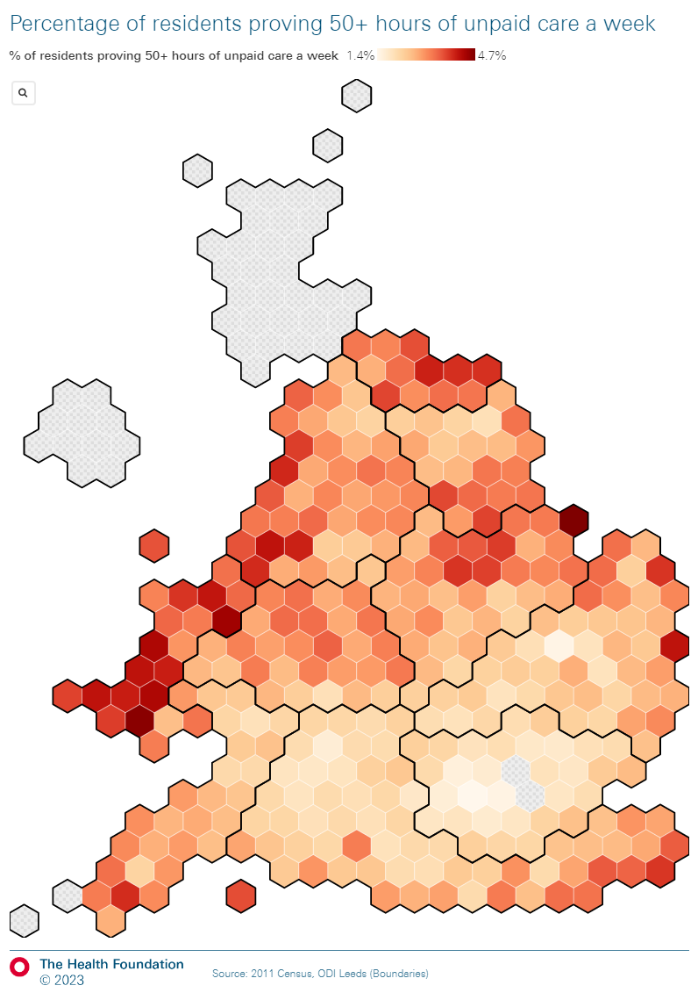
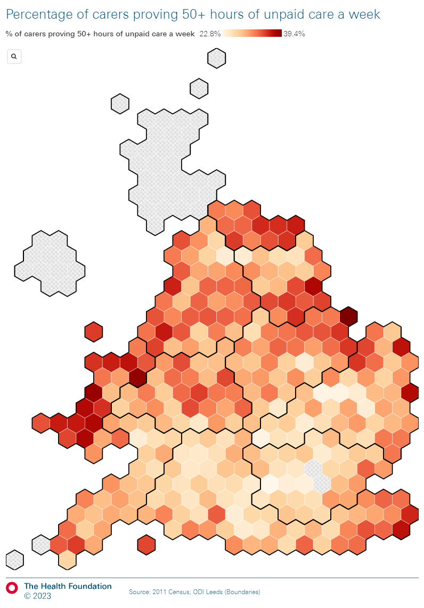

```{r, echo=FALSE, message=FALSE, warning=FALSE}
#Load packages

library(tidyverse)
library(viridis)
library(readxl)
library(data.table)
library(readODS)
library(writexl)
library(janitor)
library(aws.s3)
library(onsr)
library(ggridges)
library(ggrepel)
library(gpairs)
library(splitstackshape)
library(ggpubr)
library(knitr)
library(kableExtra)

#Clean up the global environment

rm(list = ls())

#Directories in S3

IHT_bucket <- "s3://thf-dap-tier0-projects-iht-067208b7-projectbucket-1mrmynh0q7ljp"
ASC_subfolder <- "ASC and Finance Report"
R_workbench <- path.expand("~")
localgit <- dirname(rstudioapi::getSourceEditorContext()$path)

#Themes

theme_vert <- theme(strip.text = element_text(size=10),
                    text = element_text(size = 10),
                    legend.title=element_text(size=10),
                    legend.text=element_text(size=10),
                    axis.text = element_text(size = 10),
                    axis.text.y = element_text(size = 10),
                    axis.text.x = element_text(angle = 90, hjust = 1,size = 5),
                    axis.title.x = element_text(margin = unit(c(3, 0, 0, 0), "mm"),size = 10),
                    axis.title.y = element_text(size = 10))
```

```{r, echo=FALSE, message=FALSE, warning=FALSE}
#######################################################
################### 2021 Census data ##################
#######################################################

#England

carers_census_2021_age_sex_eng <- s3read_using(read_excel,
                                           object = paste0(ASC_subfolder,"/2021 Census/sc012021reftablesengland1.xlsx"),
                                           bucket = IHT_bucket,
                                           sheet="Table 5",skip=3)

carers_census_2021_age_sex_hours_eng <- s3read_using(read_excel,
                                              object = paste0(ASC_subfolder,"/2021 Census/sc012021reftablesengland1.xlsx"),
                                              bucket = IHT_bucket,
                                              sheet="Table 17",skip=3)

carers_census_2021_sex_hours_eng <- s3read_using(read_excel,
                                              object = paste0(ASC_subfolder,"/2021 Census/sc012021reftablesengland1.xlsx"),
                                              bucket = IHT_bucket,
                                              sheet="Table 18",skip=3)


#Wales

carers_census_2021_age_sex_wales <- s3read_using(read_excel,
                                               object = paste0(ASC_subfolder,"/2021 Census/sc012021reftableswales1.xlsx"),
                                               bucket = IHT_bucket,
                                               sheet="Table 3",skip=3)

carers_census_2021_age_sex_hours_wales <- s3read_using(read_excel,
                                                     object = paste0(ASC_subfolder,"/2021 Census/sc012021reftableswales1.xlsx"),
                                                     bucket = IHT_bucket,
                                                     sheet="Table 11",skip=3)

carers_census_2021_sex_hours_wales <- s3read_using(read_excel,
                                                     object = paste0(ASC_subfolder,"/2021 Census/sc012021reftableswales1.xlsx"),
                                                     bucket = IHT_bucket,
                                                     sheet="Table 12",skip=3)

#Combined

carers_census_2021_age_sex_engwales <- plyr::rbind.fill(carers_census_2021_age_sex_eng,
                                                        carers_census_2021_age_sex_wales)

carers_census_2021_age_sex_hours_engwales <- plyr::rbind.fill(carers_census_2021_age_sex_hours_eng,
                                                              carers_census_2021_age_sex_hours_wales)

carers_census_2021_sex_hours_engwales <- plyr::rbind.fill(carers_census_2021_sex_hours_eng,
                                                              carers_census_2021_sex_hours_wales)
```

```{r, echo=FALSE, message=FALSE, warning=FALSE}
#######################################################
################### 2021 Census data ##################
#######################################################

#England

carers_census_2021_age_sex_eng <- s3read_using(read_excel,
                                           object = paste0(ASC_subfolder,"/2021 Census/sc012021reftablesengland1.xlsx"),
                                           bucket = IHT_bucket,
                                           sheet="Table 5",skip=3)

carers_census_2021_age_sex_hours_eng <- s3read_using(read_excel,
                                              object = paste0(ASC_subfolder,"/2021 Census/sc012021reftablesengland1.xlsx"),
                                              bucket = IHT_bucket,
                                              sheet="Table 17",skip=3)

#Wales

carers_census_2021_age_sex_wales <- s3read_using(read_excel,
                                               object = paste0(ASC_subfolder,"/2021 Census/sc012021reftableswales1.xlsx"),
                                               bucket = IHT_bucket,
                                               sheet="Table 3",skip=3)

carers_census_2021_age_sex_hours_wales <- s3read_using(read_excel,
                                                     object = paste0(ASC_subfolder,"/2021 Census/sc012021reftableswales1.xlsx"),
                                                     bucket = IHT_bucket,
                                                     sheet="Table 11",skip=3)

#Combined

carers_census_2021_age_sex_engwales <- plyr::rbind.fill(carers_census_2021_age_sex_eng,
                                                        carers_census_2021_age_sex_wales)

carers_census_2021_age_sex_hours_engwales <- plyr::rbind.fill(carers_census_2021_age_sex_hours_eng,
                                                              carers_census_2021_age_sex_hours_wales)

##########################################
################### Sex ##################
##########################################

la_sex <- carers_census_2021_age_sex_hours_engwales %>%
  mutate(carer_status=case_when(`Unpaid Carer Status` %in% c("9 hours or less",
                                                              "10 to 19 hours",
                                                              "20 to 34 hours",
                                                              "35 to 49 hours",
                                                              "50 or more hours") ~ "Carer",
                                `Unpaid Carer Status` %in% c("Non-carer") ~ "Non-carer",
                                TRUE ~ "NA")) %>%
  mutate(sex_carer_status=paste(carer_status,Sex,sep="-")) %>% 
  group_by(`Local Authority`,`Area Code`,sex_carer_status) %>%
  summarise(Count=sum(as.numeric(Count),na.rm=TRUE)) %>% 
  ungroup() %>%
  pivot_wider(names_from = sex_carer_status,
              names_sep = ".",
              values_from = c(Count)) %>%
  mutate(pct_carer=`Carer-Persons`/(`Non-carer-Persons`+`Carer-Persons`)*100,
         pct_carer_female=`Carer-Female`/(`Carer-Persons`)*100,
         pct_everyone_female=(`Carer-Female`+`Non-carer-Female`)/(`Non-carer-Persons`+`Carer-Persons`)*100) %>%
  select(`Local Authority`,`Area Code`,starts_with("pct"))

############################################
################### Ages ################### 
############################################

la_age <- carers_census_2021_age_sex_hours_engwales %>%
  mutate(carer_status=case_when(`Unpaid Carer Status` %in% c("9 hours or less",
                                                             "10 to 19 hours",
                                                             "20 to 34 hours",
                                                             "35 to 49 hours",
                                                             "50 or more hours") ~ "Carer",
                                `Unpaid Carer Status` %in% c("Non-carer") ~ "Non-carer",
                                TRUE ~ "NA"),
         age_group=case_when(Age %in% c("05 to 17","18 to 24","25 to 29") ~ "under 30",
                             Age %in% c("30 to 34","35 to 39","40 to 44","45 to 49") ~ "30 to 49",
                             Age %in% c("50 to 54","55 to 59","60 to 64","65 to 69") ~ "50 to 69",
                             Age %in% c("70 to 74","75 to 79","80 to 84","85 to 89","90+") ~ "over 70",
                             TRUE ~ "NA")) %>%
  mutate(age_carer_status=paste(carer_status,age_group,sep="-")) %>% 
  group_by(`Local Authority`,`Area Code`,age_carer_status) %>%
  summarise(Count=sum(as.numeric(Count),na.rm=TRUE)) %>% 
  ungroup() %>%
  pivot_wider(names_from = age_carer_status,
              names_sep = ".",
              values_from = c(Count)) %>%
  mutate(carers=rowSums(across(starts_with("Carer"))),
         noncarers=rowSums(across(starts_with("Non-carer")))) %>% 
  mutate(pct_carer_under30=`Carer-under 30`/carers*100,
         pct_carer_30to50=`Carer-30 to 49`/carers*100,
         pct_carer_50to70=`Carer-50 to 69`/carers*100,
         pct_carer_over70=`Carer-over 70`/carers*100,
         pct_everyone_under30=(`Carer-under 30`+`Non-carer-under 30`)/(carers+noncarers)*100,
         pct_everyone_30to50=(`Carer-30 to 49`+`Non-carer-30 to 49`)/(carers+noncarers)*100,
         pct_everyone_50to70=(`Carer-50 to 69`+`Non-carer-50 to 69`)/(carers+noncarers)*100,
         pct_everyone_over70=(`Carer-over 70`+`Non-carer-over 70`)/(carers+noncarers)*100) %>%
  select(`Area Code`,starts_with("pct"))

####################################################
################### Hours worked ################### 
####################################################

la_hours <- carers_census_2021_age_sex_hours_engwales %>%
  filter(`Unpaid Carer Status`!="Non-carer") %>%
  group_by(`Local Authority`,`Area Code`,`Unpaid Carer Status`) %>%
  summarise(Count=sum(as.numeric(Count),na.rm=TRUE)) %>% 
  ungroup() %>%
  pivot_wider(names_from = `Unpaid Carer Status`,
              names_sep = ".",
              values_from = c(Count)) %>%
  mutate(allhours=rowSums(across(contains("hours")))) %>%
  mutate(pct_under_20_hours=(`9 hours or less`+`10 to 19 hours`)/allhours*100,
         pct_20_to_50_hours=(`20 to 34 hours`+`35 to 49 hours`)/allhours*100,
         pct_over_50_hours=(`50 or more hours`)/allhours*100) %>%
  select(`Area Code`,starts_with("pct"))

##################################################
################### Merged data ##################
##################################################

la_summary <- la_sex %>%
  left_join(.,la_age,by="Area Code") %>%
  left_join(.,la_hours,by="Area Code")
```

## Purpose of this analysis

* To show that there is local variation in the demographic composition of carers, which translates into local authorities having to support carers with different needs.

## Sex of carers

* There is little geographical variation in the sex of carers (~60% female almost everywhere).

```{r, eval=TRUE, echo=FALSE, message=FALSE, warning=FALSE, fig.width=7,fig.height=8}
sex_chart_data <- la_summary %>%
  select(`Local Authority`,pct_carer_female)

ggplot(sex_chart_data, aes(x = pct_carer_female, y = "Female", fill="Female")) +
  geom_density_ridges(
    jittered_points = TRUE,
    position = position_points_jitter(width = 0.05, height = 0),
    point_shape = '|', point_size = 3, point_alpha = 1, alpha = 0.7,
  ) +
  scale_fill_brewer(palette="Reds",name="Sex",direction=-1) +
  guides(fill = guide_legend(reverse=TRUE)) +
  labs(title='Percentage of unpaid carers who are female', subtitle='2021 Census in England and Wales') +
  xlab("Density of percentages (LAs)") +
  ylab("Sex") +
  theme_bw()
```

## Age of carers

* There is local variation in the age of carers.

### Heatmap

```{r, eval=TRUE, echo=FALSE, message=FALSE, warning=FALSE, fig.width=12,fig.height=8}
ages_heatmap_data <- carers_census_2021_age_sex_hours_engwales %>%
  filter(Sex=="Persons"&`Unpaid Carer Status`!="Non-carer") %>%
  mutate(age_lower_band=word(Age,1,sep="to") %>% trimws("both") %>% as.numeric(),
         age_upper_band=word(Age,2,sep="to") %>% trimws("both") %>% as.numeric()) %>%
  mutate(age_lower_band=ifelse(Age=="90+",90,age_lower_band),
         age_upper_band=ifelse(Age=="90+",90,age_upper_band)) %>%
  mutate(midpoint_age=(age_lower_band+age_upper_band)/2) %>%
  group_by(`Local Authority`,`Area Code`,Age) %>%
  summarise(Count=sum(as.numeric(Count),na.rm=TRUE),
            midpoint_age=first(midpoint_age)) %>% 
  ungroup() %>%
  group_by(`Local Authority`,`Area Code`) %>%
  mutate(all=sum(Count,na.rm=TRUE),
         pct_age=Count/sum(Count,na.rm=TRUE),
         mean_age=weighted.mean(midpoint_age,Count)) %>% 
  ungroup() %>%
  janitor::clean_names()

ages_heatmap_data %>%
  ggplot(., aes(y = age,
                x = reorder(local_authority,mean_age),
                fill = pct_age))+
  geom_tile() +
  scale_fill_viridis_c(option="D", name="% of carers in band", labels = scales::percent) +
  ylab("Age band") +
  xlab("LA") +
  theme_bw() +
  theme(axis.text.x = element_text(angle = 30, hjust = 1, vjust = 1, size=6),
        axis.ticks = element_blank())

#Top 10 LAs
table1 <- ages_heatmap_data %>%
  group_by(local_authority,area_code) %>%
  summarise(mean_age=first(mean_age)) %>% 
  ungroup() %>%
  slice_max(mean_age,n=10) %>%
  arrange(desc(mean_age))
  
table2 <- ages_heatmap_data %>%
  group_by(local_authority,area_code) %>%
  summarise(mean_age=first(mean_age)) %>% 
  ungroup() %>%
  slice_min(mean_age,n=10) %>%
  arrange(mean_age)

kable(table1, caption = "Top 10 LAs with oldest carers") %>% kable_styling(bootstrap_options = "striped", full_width = F, position = "float_left")
kable(table2, caption = "Top 10 LAs with oldest carers") %>% kable_styling(bootstrap_options = "striped", full_width = F, position = "left")
```

<!-- ```{r, eval=TRUE, echo=FALSE, message=FALSE, warning=FALSE, fig.width=7,fig.height=8} -->
<!-- age_band_chart_data <- la_summary %>% -->
<!--   select(`Local Authority`,pct_carer_under30,pct_carer_30to50,pct_carer_50to70,pct_carer_over70) %>% -->
<!--   pivot_longer(!c("Local Authority"), names_to = "age_group", values_to = "pct") %>% -->
<!--   mutate(age_group=str_replace_all(age_group,"pct_carer_","")) %>% -->
<!--   mutate(age_group=fct_relevel(age_group,c("over70","50to70","30to50","under30"))) %>% -->
<!--   group_by(age_group) %>% -->
<!--   mutate(group.mean=mean(pct,na.rm=TRUE)) %>% -->
<!--   ungroup() -->

<!-- ggplot(age_band_chart_data, aes(x = pct, y = age_group, fill=age_group)) + -->
<!--   geom_density_ridges( -->
<!--     jittered_points = TRUE, -->
<!--     position = position_points_jitter(width = 0.05, height = 0), -->
<!--     point_shape = '|', point_size = 3, point_alpha = 1, alpha = 0.7, -->
<!--   ) + -->
<!--   scale_fill_brewer(palette="Greens",name="Age band",direction=-1) + -->
<!--   guides(fill = guide_legend(reverse=TRUE)) + -->
<!--   labs(title='LAs support unpaid carers with different age compositions', subtitle='2021 Census in England and Wales') + -->
<!--   xlab("Density of percentages (LAs)") + -->
<!--   ylab("Age band") + -->
<!--   theme_bw() -->
<!-- ``` -->

<!-- * Places where people are younger tend to have younger carers, and places where people are older tend to have older carers (see positive slope in all age groups). -->

<!-- ```{r, eval=TRUE, echo=FALSE, message=FALSE, warning=FALSE, fig.width=7,fig.height=8} -->
<!-- gen_pop_comp_data <- la_summary %>% -->
<!--   select(`Local Authority`,pct_carer_under30,pct_carer_30to50,pct_carer_50to70,pct_carer_over70, -->
<!--          starts_with("pct_everyone")) %>% -->
<!--   select(-"pct_everyone_female") %>% -->
<!--   merged.stack(., var.stubs = c("pct_carer","pct_everyone"), sep = "_") %>% -->
<!--   rename(age_group=.time_2) %>% -->
<!--   group_by(`Local Authority`,age_group) %>% -->
<!--   summarise(pct_carer=max(pct_carer,na.rm=TRUE), -->
<!--             pct_everyone=max(pct_everyone,na.rm=TRUE)) %>% -->
<!--   ungroup() %>% -->
<!--   mutate(age_group=fct_relevel(age_group,c("over70","50to70","30to50","under30")[4:1])) -->

<!-- gen_pop_comp_chart <- ggplot(gen_pop_comp_data, aes(x=pct_everyone/100, y=pct_carer/100, fill=age_group)) + -->
<!--   geom_point(colour="black",pch=21, size=2, alpha=0.5) + -->
<!--   stat_cor(method = "pearson", label.y = 0.50) + -->
<!--   geom_abline(intercept =0 , slope = 1,lty="dashed") + -->
<!--   xlim(0,0.50)+ylim(0,0.50) + -->
<!--   facet_wrap(~age_group, ncol=2) + -->
<!--   scale_fill_brewer(palette="Greens",name="Age band") + -->
<!--   labs(title='The age of carers reflects the age of the underlying population', subtitle='2021 Census in England and Wales') + -->
<!--   scale_x_continuous(labels = scales::percent, name="Percentage of all residents\nin age band") + -->
<!--   scale_y_continuous(labels = scales::percent, name="Percentage of unpaid carers\nin age band") + -->
<!--   annotate("text", x = 0.25, y = 0.40, size = 3, label = "More among carers than gen-pop",col="grey") + -->
<!--   annotate("text", x = 0.25, y = 0.10, size = 3, label = "Less among carers than gen-pop",col="grey") + -->
<!--   theme_bw() -->
<!-- gen_pop_comp_chart -->
<!-- ``` -->

<!-- * Places with older residents tend to have a higher proportion of carers (we know that unpaid care is more common among older age groups). -->

<!-- ```{r, eval=TRUE, echo=FALSE, message=FALSE, warning=FALSE, fig.width=7,fig.height=8} -->
<!-- gen_pop_comp_bis_data <- la_summary %>% -->
<!--   select(`Local Authority`,pct_carer,starts_with("pct_everyone")) %>% -->
<!--   select(-"pct_everyone_female") %>% -->
<!--   merged.stack(., var.stubs = c("pct_carer","pct_everyone"), sep = "_") %>% -->
<!--   rename(age_group=.time_2) %>% -->
<!--   group_by(`Local Authority`) %>% -->
<!--   mutate(pct_carer=max(pct_carer,na.rm=TRUE)) %>% -->
<!--   ungroup() %>% -->
<!--   filter(!is.na(age_group)) %>% -->
<!--   select(-".time_1") %>% -->
<!--   mutate(age_group=fct_relevel(age_group,c("over70","50to70","30to50","under30")[4:1])) %>% -->
<!--   arrange(`Local Authority`,age_group) -->

<!-- gen_pop_comp_bis_chart <- ggplot(gen_pop_comp_bis_data, -->
<!--                                  aes(x=pct_everyone/100, y=pct_carer/100, fill=age_group)) + -->
<!--   geom_point(colour="black",pch=21, size=2, alpha=0.5) + -->
<!--   stat_cor(method = "pearson", label.y = 0.15) + -->
<!--   xlim(0,0.5)+ylim(0,0.25) + -->
<!--   facet_wrap(~age_group, ncol=2, scales = "free") + -->
<!--   scale_fill_brewer(palette="Greens",name="Age band") + -->
<!--   labs(title='Local authorities with older residents have a higher prevalence of caring', subtitle='2021 Census in England and Wales') + -->
<!--   scale_x_continuous(labels = scales::percent, name="Percentage of all residents\nin age band") + -->
<!--   scale_y_continuous(labels = scales::percent, name="Percentage of all residents\nwho are unpaid carers") + -->
<!--   theme_bw() -->
<!-- gen_pop_comp_bis_chart -->
<!-- ``` -->

## Hours cared

* There is geographical variation in how may hours per week people are caring for.
* We know from previous research that care inside the household, care later in life (70+) and care for a child with a disability can be particularly 'time-consuming'.

### Heatmap

```{r, eval=TRUE, echo=FALSE, message=FALSE, warning=FALSE, fig.width=12,fig.height=8}
hours_heatmap_data <- carers_census_2021_age_sex_hours_engwales %>%
  filter(Sex=="Persons"&`Unpaid Carer Status`!="Non-carer") %>%
  group_by(`Local Authority`,`Area Code`,`Unpaid Carer Status`) %>% #Sum over ages
  summarise(Count=sum(as.numeric(Count),na.rm=TRUE)) %>% 
  ungroup() %>%
  group_by(`Local Authority`,`Area Code`) %>%
  mutate(all=sum(as.numeric(Count),na.rm=TRUE)) %>% #add total over all hours
  ungroup() %>%
  mutate(pct_hours=Count/all,
         `Unpaid Carer Status`=fct_relevel(`Unpaid Carer Status`,
                                           c("9 hours or less","10 to 19 hours","20 to 34 hours","35 to 49 hours","50 or more hours")),
         over_below_9_hours=case_when(`Unpaid Carer Status` %in% c("9 hours or less") ~ "under 9 hours",
                                       `Unpaid Carer Status` %in% c("10 to 19 hours","20 to 34 hours","35 to 49 hours","50 or more hours") ~ "over 9 hours",
                                       TRUE ~ "NA"),
         over_below_20_hours=case_when(`Unpaid Carer Status` %in% c("9 hours or less","10 to 19 hours") ~ "under 20 hours",
                                       `Unpaid Carer Status` %in% c("20 to 34 hours","35 to 49 hours","50 or more hours") ~ "over 20 hours",
                                       TRUE ~ "NA"),
         over_below_50_hours=case_when(`Unpaid Carer Status` %in% c("9 hours or less","10 to 19 hours","20 to 34 hours","35 to 49 hours") ~ "under 50 hours",
                                       `Unpaid Carer Status` %in% c("50 or more hours") ~ "over 50 hours",
                                       TRUE ~ "NA")) %>%
  arrange(`Local Authority`,`Unpaid Carer Status`) %>%
  group_by(`Local Authority`,`Area Code`,over_below_9_hours) %>%
  mutate(pct_over_below_9_hours=sum(Count,na.rm=TRUE)/all*100) %>% #Add pct under/over 9 hours
  ungroup() %>% 
  group_by(`Local Authority`,`Area Code`,over_below_20_hours) %>%
  mutate(pct_over_below_20_hours=sum(Count,na.rm=TRUE)/all*100,) %>% #Add pct under/over 20 hours
  ungroup() %>%
  group_by(`Local Authority`,`Area Code`,over_below_50_hours) %>%
  mutate(pct_over_below_50_hours=sum(Count,na.rm=TRUE)/all*100) %>% #Add pct under/over 50 hours
  ungroup() %>%
  mutate(pct_below_9_hours=ifelse(over_below_9_hours=="under 9 hours",pct_over_below_9_hours,NA),
         pct_over_9_hours=ifelse(over_below_9_hours=="over 9 hours",pct_over_below_9_hours,NA),
         pct_below_20_hours=ifelse(over_below_20_hours=="under 20 hours",pct_over_below_20_hours,NA),
         pct_over_20_hours=ifelse(over_below_20_hours=="over 20 hours",pct_over_below_20_hours,NA),
         pct_below_50_hours=ifelse(over_below_50_hours=="under 50 hours",pct_over_below_50_hours,NA),
         pct_over_50_hours=ifelse(over_below_50_hours=="over 50 hours",pct_over_below_50_hours,NA)) %>%
  group_by(`Local Authority`,`Area Code`) %>%
  mutate(pct_below_9_hours=max(pct_below_9_hours,na.rm=TRUE),
         pct_over_9_hours=max(pct_over_9_hours,na.rm=TRUE),
         pct_below_20_hours=max(pct_below_20_hours,na.rm=TRUE),
         pct_over_20_hours=max(pct_over_20_hours,na.rm=TRUE),
         pct_below_50_hours=max(pct_below_50_hours,na.rm=TRUE),
         pct_over_50_hours=max(pct_over_50_hours,na.rm=TRUE)) %>%     
  ungroup() %>%
  select(-c("over_below_9_hours","pct_over_below_9_hours",
            "over_below_20_hours","pct_over_below_20_hours",
            "over_below_50_hours","pct_over_below_50_hours")) %>%
  arrange(`Local Authority`,`Unpaid Carer Status`) %>%
  janitor::clean_names()

hours_heatmap_data %>%
  ggplot(., aes(y = unpaid_carer_status,
                x = reorder(local_authority,pct_below_20_hours),
                fill = pct_hours))+
  geom_tile() +
  scale_fill_viridis_c(option="A", name="% of carers in band", labels = scales::percent,direction=-1) +
  xlab("LA") +
  ylab("Hours per week") +
  theme_bw() +
  theme(axis.text.x = element_text(angle = 30, hjust = 1, vjust = 1, size=6),
        axis.ticks = element_blank())

#Top 10 LAs
table1 <- hours_heatmap_data %>%
  group_by(local_authority,area_code) %>%
  summarise(pct_over_20_hours=first(pct_over_20_hours)) %>% 
  ungroup() %>%
  slice_max(pct_over_20_hours,n=10) %>%
  arrange(desc(pct_over_20_hours))
  
table2 <- hours_heatmap_data %>%
  group_by(local_authority,area_code) %>%
  summarise(pct_over_20_hours=first(pct_over_20_hours)) %>% 
  ungroup() %>%
  slice_min(pct_over_20_hours,n=10) %>%
  arrange(pct_over_20_hours)

kable(table1, caption = "Top 10 LAs with most hours") %>% kable_styling(bootstrap_options = "striped", full_width = F, position = "float_left")
kable(table2, caption = "Top 10 LAs with least hours") %>% kable_styling(bootstrap_options = "striped", full_width = F, position = "left")
```

### Hex-maps

```{r, eval=TRUE, echo=FALSE, message=FALSE, warning=FALSE, fig.show = "hold", out.width = "50%", fig.align = "default"}


```

<!-- ```{r, eval=TRUE, echo=FALSE, message=FALSE, warning=FALSE} -->
<!--  -->
<!-- ``` -->

<!-- ```{r, eval=TRUE, echo=FALSE, message=FALSE, warning=FALSE} -->
<!-- hours_chart_data <- la_summary %>% -->
<!--   select(`Local Authority`,contains("hours")) %>% -->
<!--   pivot_longer(!c("Local Authority"), names_to = "hours_group", values_to = "pct") %>% -->
<!--   mutate(hours_group=str_replace_all(hours_group,"pct_","") %>% str_replace_all(.,"_"," ")) %>% -->
<!--   mutate(hours_group=fct_relevel(hours_group,c("over 50 hours","20 to 50 hours","under 20 hours"))) %>% -->
<!--   group_by(hours_group) %>% -->
<!--   mutate(group.mean=mean(pct,na.rm=TRUE)) %>%  -->
<!--   ungroup() -->

<!-- ggplot(hours_chart_data, aes(x = pct, y = hours_group, fill=hours_group)) + -->
<!--   geom_density_ridges( -->
<!--     jittered_points = TRUE, -->
<!--     position = position_points_jitter(width = 0.05, height = 0), -->
<!--     point_shape = '|', point_size = 3, point_alpha = 1, alpha = 0.7, -->
<!--   ) + -->
<!--   scale_fill_brewer(palette="Purples",name="Hours cared per week",direction=-1) + -->
<!--   guides(fill = guide_legend(reverse=TRUE)) + -->
<!--   labs(title="LAs support unpaid carers with different care 'workloads'", subtitle='2021 Census in England and Wales') + -->
<!--   xlab("Density of percentages (LAs)") + -->
<!--   ylab("Hours per week") + -->
<!--   theme_bw() -->
<!-- ``` -->

## Hours cared vs. age of carers

### Muli-point barbell chart

```{r, eval=TRUE, echo=FALSE, message=FALSE, warning=FALSE, fig.width=12,fig.height=8}
####### Age vs hours worked

age_mini <- ages_heatmap_data %>% group_by(local_authority,area_code) %>% summarise(mean_age=first(mean_age)) %>% ungroup()
hours_mini <-hours_heatmap_data %>% group_by(area_code) %>% summarise(pct_over_9_hours=first(pct_over_9_hours),pct_over_20_hours=first(pct_over_20_hours), pct_over_50_hours=first(pct_over_50_hours)) %>% ungroup()
prev_mini <- carers_census_2021_age_sex_engwales %>% janitor::clean_names() %>% filter(sex=="Persons"&unpaid_carer_status=="Unpaid carer") %>% group_by(area_code) %>% summarise(count=sum(as.numeric(count),na.rm=TRUE),pop=sum(as.numeric(population),na.rm=TRUE)) %>% ungroup() %>% mutate(pct_carer=count/pop*100) %>% select(-c("count","pop")) 

age_hours_corr_data <- age_mini %>%
  left_join(.,hours_mini,by="area_code") %>%
  left_join(.,prev_mini,by="area_code")
rm(age_mini,hours_mini)

multipoint_barbell_data <- age_hours_corr_data %>%
  arrange(mean_age) %>% 
  select(local_authority,pct_over_9_hours,pct_over_20_hours,pct_over_50_hours) %>%
  rename(`9 hours`=pct_over_9_hours,
         `20 hours`=pct_over_20_hours,
         `50 hours`=pct_over_50_hours)

level_order <- multipoint_barbell_data$local_authority
  
ggplot() +
  # reshape the data frame & get min value so you can draw an eye-tracking line (this is one geom)
  geom_segment(
    data = gather(multipoint_barbell_data, measure, pct, -local_authority) %>% 
      group_by(local_authority) %>% 
      top_n(-1) %>% 
      slice(1) %>%
      ungroup(),
    aes(x = 0, xend = pct, y = local_authority, yend = local_authority),
    linetype = "dotted", size = 0.5, color = "gray80"
  ) +
  # reshape the data frame & get min/max category values so you can draw the segment (this is another geom)
  geom_segment(
    data = gather(multipoint_barbell_data, measure, pct, -local_authority) %>% 
      group_by(local_authority) %>% 
      summarise(start = range(pct)[1], end = range(pct)[2]) %>% 
      ungroup(),
    aes(x = start, xend = end, y = local_authority, yend = local_authority),
    color = "gray80", size = 2) +
  # reshape the data frame & plot the points
  geom_point(
    data = gather(multipoint_barbell_data, measure, pct, -local_authority),
    aes(pct, local_authority, color = measure), 
    size = 2
  ) +
  # i just extended the scale a bit + put axis on top; choose aesthetics that work 
  # for you
  scale_y_discrete(limits = level_order) +
  scale_colour_manual(
    name = "% of carers caring more than",
    values = c("#74c476","#238b45","#00441b"),
    limits = c("9 hours","20 hours","50 hours")  ) +
  labs(
    x = "Percentage of carers", y = "Local authority (youngest to oldest carers  →)"
  ) +
  coord_flip() +
  theme_bw() +
  theme(legend.position = "top",
        axis.text.x = element_text(angle = 30, hjust = 1, vjust = 1, size=6),
        axis.ticks = element_blank())

# age_hours_corr_plot_one <- ggplot(age_hours_corr_data, aes(x=mean_age, y=pct_over_20_hours/100,
#                                                            size=pct_carer, label=local_authority)) +
#   geom_point(colour="cornflowerblue",pch=21, alpha=0.75) +
#   geom_label_repel(size = 3,box.padding = unit(0.2, "lines"),alpha = 0.6,) +
#   stat_cor(method = "pearson", label.y = 0.65, show.legend = FALSE) +
#   scale_x_continuous(name="Average age of carers") +
#   scale_y_continuous(labels = scales::percent, name="Percentage of carers\ncaring 20+ hours") +
#   guides(size=guide_legend(title="Carers prevalence (%)")) +
#   theme_bw()
# 
# age_hours_corr_plot_one
# 
# age_hours_corr_plot_two <- ggplot(age_hours_corr_data, aes(x=mean_age, y=pct_over_50_hours/100,
#                                                            size=pct_carer, label=local_authority)) +
#   geom_point(colour="darkblue",pch=21, alpha=0.75) +
#   geom_label_repel(size = 3,box.padding = unit(0.2, "lines"),alpha = 0.6,) +
#   stat_cor(method = "pearson", label.y = 0.65, show.legend = FALSE) +
#   scale_x_continuous(name="Average age of carers") +
#   scale_y_continuous(labels = scales::percent, name="Percentage of carers\ncaring 50+ hours") +
#   guides(size=guide_legend(title="Carers prevalence (%)")) +
#   theme_bw()
# 
# age_hours_corr_plot_two
```

### Correlations {.tabset}

#### mean age vs. >9-hours

```{r, eval=TRUE, echo=FALSE, message=FALSE, warning=FALSE}
age_hours_corr_plot_zero <- ggplot(age_hours_corr_data, aes(x=mean_age, y=pct_over_9_hours/100,
                                                           size=pct_carer, label=local_authority)) +
  geom_point(colour="#74c476",pch=21, alpha=0.75) +
  geom_label_repel(size = 3,box.padding = unit(0.2, "lines"),alpha = 0.6,) +
  stat_cor(method = "pearson", label.y = 0.65, show.legend = FALSE) +
  scale_x_continuous(name="Average age of carers") +
  scale_y_continuous(labels = scales::percent, name="Percentage of carers\ncaring 9+ hours",
                     lim=c(0,0.8)) +
  guides(size=guide_legend(title="Carers prevalence (%)")) +
  theme_bw()

age_hours_corr_plot_zero
```

#### mean age vs. >20-hours

```{r, eval=TRUE, echo=FALSE, message=FALSE, warning=FALSE}
age_hours_corr_plot_two <- ggplot(age_hours_corr_data, aes(x=mean_age, y=pct_over_20_hours/100,
                                                           size=pct_carer, label=local_authority)) +
  geom_point(colour="#238b45",pch=21, alpha=0.75) +
  geom_label_repel(size = 3,box.padding = unit(0.2, "lines"),alpha = 0.6,) +
  stat_cor(method = "pearson", label.y = 0.65, show.legend = FALSE) +
  scale_x_continuous(name="Average age of carers") +
  scale_y_continuous(labels = scales::percent, name="Percentage of carers\ncaring 20+ hours",
                     lim=c(0,0.8)) +
  guides(size=guide_legend(title="Carers prevalence (%)")) +
  theme_bw()

age_hours_corr_plot_two
```

#### mean age vs. >50-hours

```{r, eval=TRUE, echo=FALSE, message=FALSE, warning=FALSE}
age_hours_corr_plot_three <- ggplot(age_hours_corr_data, aes(x=mean_age, y=pct_over_50_hours/100,
                                                           size=pct_carer, label=local_authority)) +
  geom_point(colour="#00441b",pch=21, alpha=0.75) +
  geom_label_repel(size = 3,box.padding = unit(0.2, "lines"),alpha = 0.6,) +
  stat_cor(method = "pearson", label.y = 0.65, show.legend = FALSE) +
  scale_x_continuous(name="Average age of carers") +
  scale_y_continuous(labels = scales::percent, name="Percentage of carers\ncaring 50+ hours",
                     lim=c(0,0.8)) +
  guides(size=guide_legend(title="Carers prevalence (%)")) +
  theme_bw()

age_hours_corr_plot_three
```

<!-- ## Networked Data Lab data on unpaid carers -->

<!-- * Our Networked Data Lab partners were able to get data on carer assessments from five local authorities. -->

<!-- ```{r, eval=TRUE, echo=FALSE, message=FALSE, warning=FALSE} -->
<!-- knitr::include_graphics("NDL local authorities.png") -->
<!-- ``` -->

<!-- * According to the 2021 Census, each of our five local authority areas have carer populations that closely resemble the national average in terms of age and sex. -->

<!-- ```{r, eval=TRUE, echo=FALSE, message=FALSE, warning=FALSE} -->
<!-- base_pyramid_national <- carers_census_2021_age_sex_engwales %>% -->
<!--   mutate(ndl_location_grouping="England and Wales") %>%  -->
<!--   filter(`Unpaid Carer Status`=="Unpaid carer"&Sex!="Persons"&ndl_location_grouping!="Non NDL") %>%  -->
<!--   group_by(ndl_location_grouping,`Sex`,`Age`) %>% -->
<!--   summarise(Count=sum(as.numeric(Count),na.rm=TRUE)) %>%  -->
<!--   ungroup() %>% -->
<!--   group_by(ndl_location_grouping) %>% -->
<!--   mutate(Total=sum(Count,na.rm=TRUE), -->
<!--          Percent=Count/sum(Count,na.rm=TRUE)) %>%  -->
<!--   ungroup() %>%  -->
<!--   mutate(Count=ifelse(Sex=="Male",-1*Count,Count), -->
<!--          Percent=ifelse(Sex=="Male",-1*Percent,Percent)) -->

<!-- base_pyramid_locations <- carers_census_2021_age_sex_engwales %>% -->
<!--   mutate(ndl_location_grouping=case_when(`Local Authority` %in% c("Liverpool","Wirral") ~ "Liverpool and Wirral", -->
<!--                                          `Local Authority` %in% c("Leeds") ~ "Leeds", -->
<!--                                          `Local Authority` %in% c("Harrow","Brent", -->
<!--                                                                   "Hillingdon","Ealing", -->
<!--                                                                   "Hounslow","Hammersmith and Fulham", -->
<!--                                                                   "Kensington and Chelsea", -->
<!--                                                                   "City of London and Westminster") ~ "North West London", -->
<!--                                          `Local Authority` %in% c("Neath Port Talbot") ~ "Neath Port Talbot", -->
<!--                                          `Local Authority` %in% c("Swansea") ~ "Swansea", -->
<!--                                          TRUE ~ "Non NDL")) %>%  -->
<!--   filter(`Unpaid Carer Status`=="Unpaid carer"&Sex!="Persons"&ndl_location_grouping!="Non NDL") %>%  -->
<!--   group_by(ndl_location_grouping,`Sex`,`Age`) %>% -->
<!--   summarise(Count=sum(as.numeric(Count),na.rm=TRUE)) %>%  -->
<!--   ungroup() %>% -->
<!--   group_by(ndl_location_grouping) %>% -->
<!--   mutate(Total=sum(Count,na.rm=TRUE), -->
<!--          Percent=Count/sum(Count,na.rm=TRUE)) %>%  -->
<!--   ungroup() %>%  -->
<!--   mutate(Count=ifelse(Sex=="Male",-1*Count,Count), -->
<!--          Percent=ifelse(Sex=="Male",-1*Percent,Percent)) -->

<!-- base_pyramid_locations <- plyr::rbind.fill(base_pyramid_national,base_pyramid_locations) -->
<!-- rm(base_pyramid_national) -->

<!-- pop_range_breaks_locations <- pretty(range(base_pyramid_locations$Percent), n = 5) -->

<!-- ggplot(base_pyramid_locations, -->
<!--        aes(x = Percent, -->
<!--            y = Age, -->
<!--            fill = Sex)) + -->
<!--   geom_col() + -->
<!--   facet_wrap(~ndl_location_grouping, ncol=3) + -->
<!--   scale_x_continuous(breaks  = pop_range_breaks_locations, -->
<!--                      labels = scales::percent(abs(pop_range_breaks_locations))) + -->
<!--   scale_fill_brewer(palette = "Set1", name="Sex") + -->
<!--   xlab("Percentage of carers") + -->
<!--   theme_bw() + -->
<!--   theme(legend.position = "top") -->
<!-- ``` -->

<!-- * There are clearer disparities in terms of hours worked, with some areas having a higher proportion of older carer caring for 20+ hours a week (compared to the national average). -->

<!-- ```{r, eval=TRUE, echo=FALSE, message=FALSE, warning=FALSE} -->
<!-- base_hours_pyramid_national <- carers_census_2021_age_sex_hours_engwales %>% -->
<!--   mutate(ndl_location_grouping="England and Wales", -->
<!--          hours_status=case_when(`Unpaid Carer Status` %in% c("9 hours or less", -->
<!--                                                              "10 to 19 hours") ~ "Under 20 hours", -->
<!--                                 `Unpaid Carer Status` %in% c("20 to 34 hours", -->
<!--                                                              "35 to 49 hours", -->
<!--                                                              "50 or more hours") ~ "Over 20 hours", -->
<!--                                 TRUE ~ "NA")) %>%  -->
<!--   filter(`Unpaid Carer Status`!="Non-carer"&Sex!="Persons"&ndl_location_grouping!="Non NDL") %>%  -->
<!--   group_by(ndl_location_grouping,hours_status,`Age`) %>% -->
<!--   summarise(Count=sum(as.numeric(Count),na.rm=TRUE)) %>%  -->
<!--   ungroup() %>% -->
<!--   group_by(ndl_location_grouping) %>% -->
<!--   mutate(Total=sum(Count,na.rm=TRUE), -->
<!--          Percent=Count/sum(Count,na.rm=TRUE)) %>%  -->
<!--   ungroup() %>%  -->
<!--   mutate(Count=ifelse(hours_status=="Under 20 hours",-1*Count,Count), -->
<!--          Percent=ifelse(hours_status=="Under 20 hours",-1*Percent,Percent)) -->

<!-- base_hours_pyramid_locations <- carers_census_2021_age_sex_hours_engwales %>% -->
<!--   mutate(ndl_location_grouping=case_when(`Local Authority` %in% c("Liverpool","Wirral") ~ "Liverpool and Wirral", -->
<!--                                          `Local Authority` %in% c("Leeds") ~ "Leeds", -->
<!--                                          `Local Authority` %in% c("Harrow","Brent", -->
<!--                                                                   "Hillingdon","Ealing", -->
<!--                                                                   "Hounslow","Hammersmith and Fulham", -->
<!--                                                                   "Kensington and Chelsea", -->
<!--                                                                   "City of London and Westminster") ~ "North West London", -->
<!--                                          `Local Authority` %in% c("Neath Port Talbot") ~ "Neath Port Talbot", -->
<!--                                          `Local Authority` %in% c("Swansea") ~ "Swansea", -->
<!--                                          TRUE ~ "Non NDL"), -->
<!--          hours_status=case_when(`Unpaid Carer Status` %in% c("9 hours or less", -->
<!--                                                              "10 to 19 hours") ~ "Under 20 hours", -->
<!--                                 `Unpaid Carer Status` %in% c("20 to 34 hours", -->
<!--                                                              "35 to 49 hours", -->
<!--                                                              "50 or more hours") ~ "Over 20 hours", -->
<!--                                 TRUE ~ "NA")) %>%  -->
<!--   filter(`Unpaid Carer Status`!="Non-carer"&Sex!="Persons"&ndl_location_grouping!="Non NDL") %>%  -->
<!--   group_by(ndl_location_grouping,hours_status,`Age`) %>% -->
<!--   summarise(Count=sum(as.numeric(Count),na.rm=TRUE)) %>%  -->
<!--   ungroup() %>% -->
<!--   group_by(ndl_location_grouping) %>% -->
<!--   mutate(Total=sum(Count,na.rm=TRUE), -->
<!--          Percent=Count/sum(Count,na.rm=TRUE)) %>%  -->
<!--   ungroup() %>%  -->
<!--   mutate(Count=ifelse(hours_status=="Under 20 hours",-1*Count,Count), -->
<!--          Percent=ifelse(hours_status=="Under 20 hours",-1*Percent,Percent)) -->

<!-- base_hours_pyramid_locations <- plyr::rbind.fill(base_hours_pyramid_national,base_hours_pyramid_locations) -->
<!-- rm(base_hours_pyramid_national) -->

<!-- pop_range_breaks_hours_locations <- pretty(range(base_hours_pyramid_locations$Percent), n = 5) -->

<!-- ggplot(base_hours_pyramid_locations, -->
<!--        aes(x = Percent, -->
<!--            y = Age, -->
<!--            fill = hours_status)) + -->
<!--   geom_col() + -->
<!--   facet_wrap(~ndl_location_grouping, ncol=3) + -->
<!--   scale_x_continuous(breaks  = pop_range_breaks_hours_locations, -->
<!--                      labels = scales::percent(abs(pop_range_breaks_hours_locations))) + -->
<!--   scale_fill_brewer(palette = "Paired", name="Hours cared per week", direction=-1) + -->
<!--   xlab("Percentage of carers") + -->
<!--   guides(fill = guide_legend(reverse=TRUE)) + -->
<!--   theme_bw() + -->
<!--   theme(legend.position = "top") -->
<!-- ``` -->
